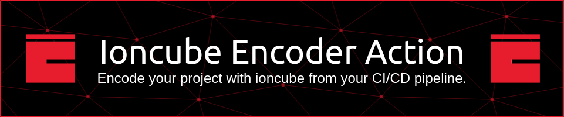

[](https://github.com/MuriloChianfa/ioncube-encoder-action/actions/workflows/check-dist.yml)
[](https://github.com/MuriloChianfa/ioncube-encoder-action/actions/workflows/ci.yml)
[](https://github.com/MuriloChianfa/ioncube-encoder-action/actions/workflows/linter.yml)
[](https://github.com/MuriloChianfa/ioncube-encoder-action/actions/workflows/codeql-analysis.yml)

Automate and streamline IonCube encoding for your PHP project under Laravel, Joomla, WordPress frameworks with this powerful GitHub Action. Encode your source code effortlessly, ensuring an extra layer of security for your proprietary codebase.

## Features

- **Seamless Integration:** Easily integrate IonCube encoding into your CI/CD workflows with a straightforward setup using this GitHub Action.

- **Version Control:** Specify the IonCube version to use for encoding, ensuring compatibility with your project requirements.

- **Flexible Configuration:** Customize the source and output directories, making it adaptable to various project structures.

- **Efficient Workflow:** Save time and resources by automating the encoding process, allowing you to focus on building and deploying your applications.

## Getting Started

- **Configure Workflow**: Copy the example workflow into your project's .github/workflows directory, adjusting parameters as needed.
- **Run Workflow**: Push your changes to trigger the IonCube encoding workflow and enjoy the automated process.

### Usage

> For vanilla PHP projects:

```yaml
name: Encode with IonCube

on: [push]

jobs:
  encode:
    runs-on: ubuntu-latest

    steps:
    - name: Checkout Repository
      uses: actions/checkout@v2

    - name: IonCube Encode
      uses: murilochianfa/ioncube-encode-action@v1.0.0
      with:
        source: 'src'
        output: 'encrypted'
```

> For Laravel projects:

- **Setup Secrets**: Create a secret named IONCUBE_PASSPHRASE containing the passphrase to encode files.
- **Install composer packages**: Sometimes you need to install the composer packages before of project encode.

```yaml
name: Encode Laravel with IonCube

on: [push]

jobs:
  encode:
    runs-on: ubuntu-latest

    steps:
    - name: Checkout Repository
      uses: actions/checkout@v2

    - name: IonCube Encode Project
      uses: murilochianfa/ioncube-encode-action@v1.0.0
      with:
        source: 'src'
        output: 'encrypted'
        passphrase: ${{ secrets.IONCUBE_PASSPHRASE }}
        # License file path in runtime
        with-license: /opt/project/license
        # Callback file path in runtime
        callback-file: /opt/project/public/ioncube.php

    - name: IonCube Encode Callback File
      uses: murilochianfa/ioncube-encode-action@v1.0.0
      with:
        source: 'src/public/ioncube.php'
        output: 'encrypted/public/ioncube.php'
        passphrase: ${{ secrets.IONCUBE_PASSPHRASE }}
```

### Inputs

- ***trial***: Encode file with trial version of ioncube. *(default: true)*
- ***template***: The template to choose the best parameters for type of projects. *(default: php)*
- ***source***: The file or directory containing your PHP project. *(default: src)*
- ***output***: The file or directory where the encoded project will be saved. *(default: encrypted)*
- ***encoder-version***: The Ioncube encoder version. *(default: current)*
- ***php-target-version***: The PHP encoded files target version. *(default: 8.2)*
- ***arch***: Architecture of target environment runner. *(default: 64)*
- ***allow-reflection***: Name or glob to funcions or classes for allow the reflection API. *(default: false)*
- ***allow-reflection-all***: Allow the reflection API at all the PHP code. *(default: false)*
- ***encrypt***: Name or glob to files to encrypt. *(default: false)*
- ***binary***: Encode files in binary format. *(default: false)*
- ***optimize***: Level of encoding performance. *(default: more)*
- ***no-doc-comments***: Not allow doc comments on encoded files. *(default: false)*
- ***without-loader-check***: Disable the ioncube loader installation verification. *(default: false)*
- ***preamble-file***: File for insert into header of all encoded files. *(default: false)*
- ***passphrase***: Text to identify and encode the project unically. *(default: false)*
- ***license-check***: Mode of license validation for encoded files. *(default: auto)*
- ***with-license***: The license file path at runtime environment. *(default: false)*
- ***callback-file***: File to validate manually when license is invalid. *(default: false)*

<hr>

> [!IMPORTANT]
>
> Make sure to ignore the commits for encrypted files.
> After encrypt your project, test them for make sure your correct functionality.

## Example

Explore a complete example of a workflow that utilizes this action in the <a href="https://github.com/MuriloChianfa/ioncube-encoder-action">example project</a>.

## Testing this package

```bash
npm run lint
npm run test
npm run package
```

### Dependencies

- *NodeJS 20.8.0 or higher.*
- *NPM 10.1.0 or higher.*

## Commitment to Quality
During package development, try as best as possible to embrace good design and
development practices to try to ensure that this package is as good as it can
be. The checklist for package development includes:

-   ✅ Have no Lint warnings throughout all code.
-   ✅ Include comprehensive documentation in README.md.

## Contributions

We welcome contributions! Feel free to open issues for suggestions or bug reports, and pull requests are highly appreciated.

## Security

If you discover any security related issues, please email murilo.chianfa@outlook.com instead of using the issue tracker.

## Credits

- [Murilo Chianfa](https://github.com/MuriloChianfa)
- [All Contributors](../../contributors)

## License

This project is licensed under the MIT License - see the [LICENSE](LICENSE.md) file for details.

## Acknowledgments

Special thanks to <a href="https://www.ioncube.com/">IonCube</a> for providing robust encoding technology.
